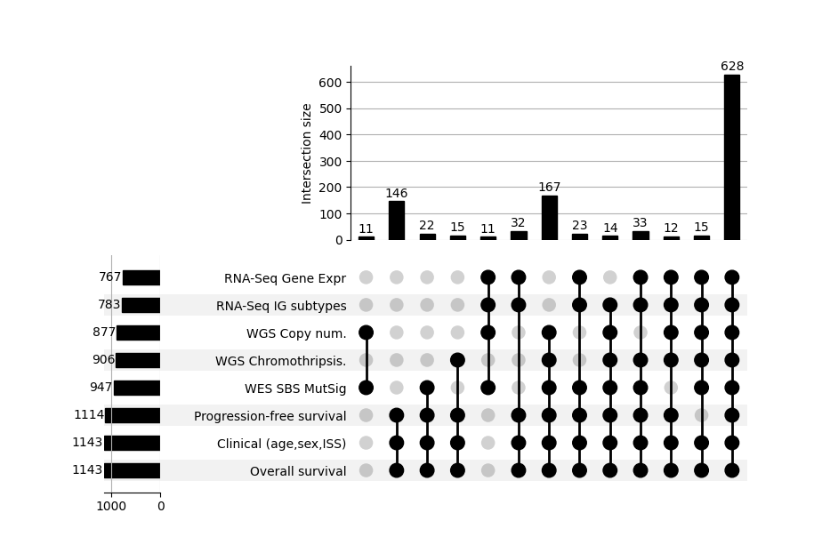
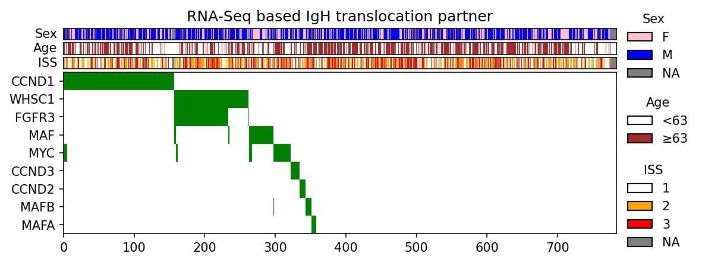
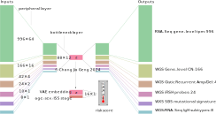
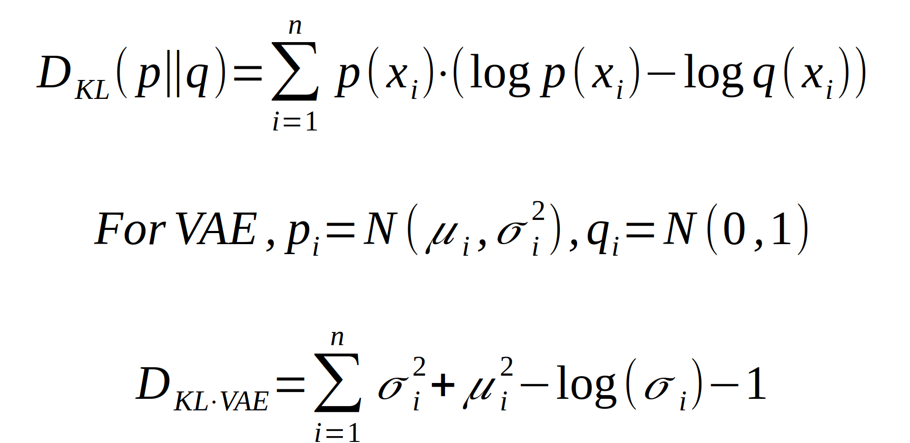
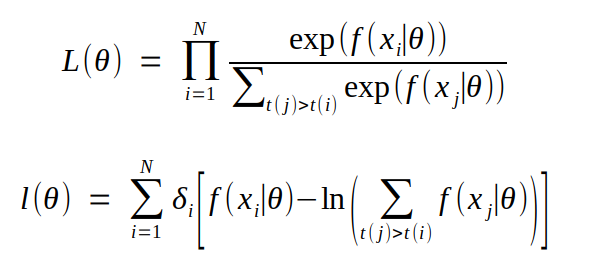
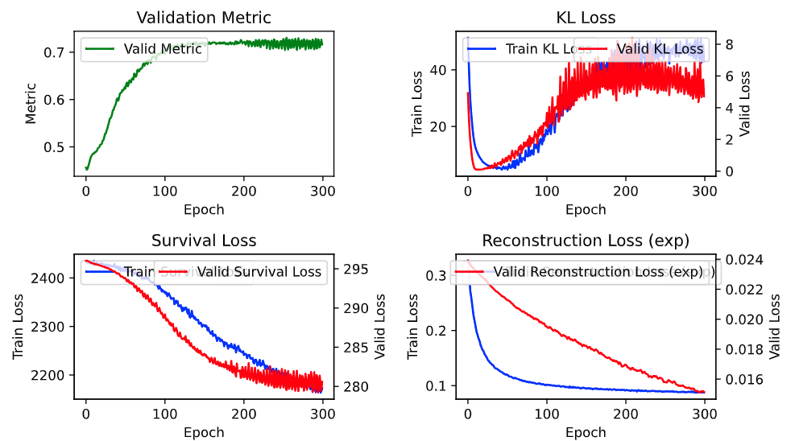
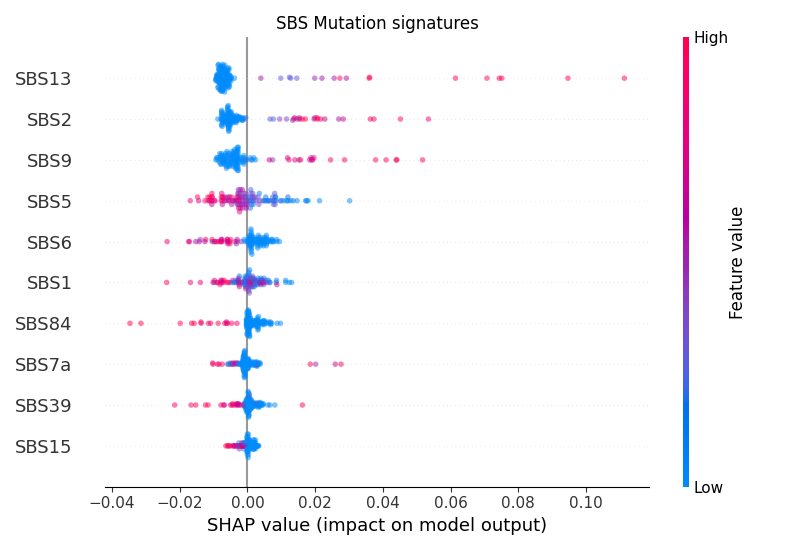
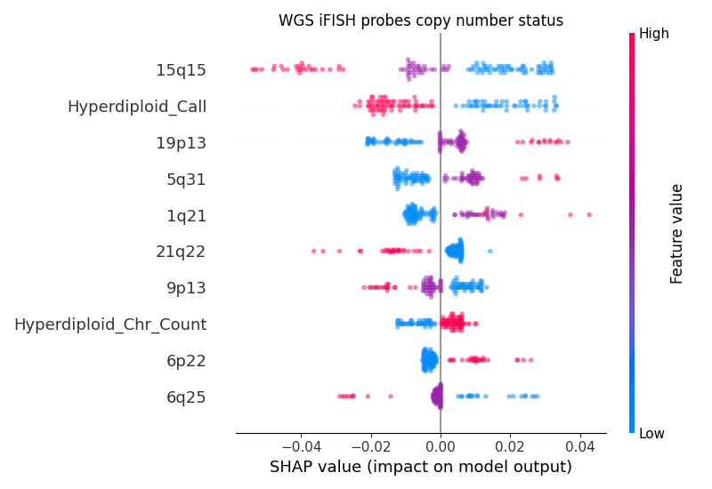
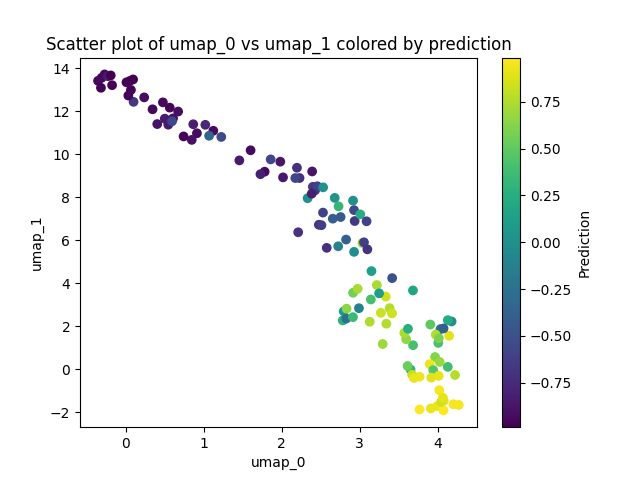

# Cancer Survival ML

<p align="left"></p>

## Table of Contents

- [Introduction](#introduction)
- [Dataset](#dataset)
- [Models](#models)
- [Results](#results)
- [References](#references)
- [Acknowledgements](#acknowledgements)
- [License](#license)

## Introduction

Predicting the survival of newly diagnosed multiple myeloma patients using information from routine clinical parameters and next generation sequencing technologies.

Techniques used: statistical tests, dimensionality reduction, variational autoencoders, survival regression

## Dataset

We used the CoMMpass (Relating Clinical Outcomes in MM to Personal Assessment of Genetic Profile) trial (NCT01454297) data of Multiple Myeloma Research Foundation (MMRF) [[1](#references)]. 

We used two different versions of CoMMpass data, Interim Analysis 16 (IA16) and Interim Analysis 21 (IA21) versions. This is because IA16 is the latest release which has information on IGH translocation partners. 

### Data availability

The number of patients with carrying information in each data modality can be visualized. Most importantly, for observations to be useful, <strong>overall survival</strong> and <strong>clinical data</strong> must not be missing.
<p align="left"></p>

We see that ~600 samples have information in all data modalities. These are high quality samples which can be used as validation when training multi-modal risk predictors. The code to generate this upset plot alongside visualization of other basic patient characteristics is available as `modules_baseline/plot-upset.py`.

### Multivariate visualization

IgH translocations is the main classification method for subtyping myeloma cases. In around 50% of myeloma patients, there is a translocation between the IgH immunoglobulin enhancer on chromosome 11 and a parter oncogene on a different chromosome. This results in upregulation of that oncogene. There are 9 canonical translocation partners recognised in literature. We can visualize the intersection between clinical variables and IgH translocation partners with an *OncoPrint*.

<p align="left"></p>

In the remaining 50% of myeloma patients where no IgH translocation occurs, a process known as <strong>hyperdiploidy</strong> occurs. Hyperdiploidy is the trisomy of odd-numbered chromosomes, and it is slightly protective.

## Models

### Model architecture
The layers and layer dimensions of VAE risk model is as shown:

<p align="center"></p>

1. Data from Whole genome sequencing (WGS), whole exome sequencing (WXS), and RNA-Sequencing (RNA-Seq) are first individually encoded using the peripheral encoder layers.
    1. WGS IA21*: Gene level copy number, GISTIC recurrently amplified/deleted regions, interphase FISH probe locations
    2. WXS IA21: Single Base Substitution Mutational signatures
    3. RNA-Seq IA21: Gene level transcripts per million
    4. WGS IA16/RNA-Seq IA16: IgH translocation partner classification
       
2. Encoded data is concatenated and jointly encoded by passing through the bottleneck layer.
   
3. For risk prediction, bottleneck embeddings (`z`) are concatenated with clinical information and passed through a fully connected layer.
    1. clinical information: age, sex, ISS stage, retrieved from IA21
    2. desired values: right-censored progression-free survival (PFS) or overall survival (OS), retrieved from IA21
       
4. For input reconstruction, bottleneck embeddings (`z`) are passed through the bottleneck decoder layer and peripheral decoder layers.

### Training

Our training objective is to model is progression free survival (PFS) in days. A secondary objective is to model Overall Survival (OS) in days.

Our optimization objective is the 2 standard VAE loss terms - **KL divergence** and **reconstruction error** (Mean Square Error). The generic KL divergence and the simplified version for the VAE are shown:

<p align="center"></p>

We add a third loss term for our survival modelling task, **NPLL** (Negative partial log likelihood). This is a generalised, non-linear version of the Cox's partial log likelihood objective. 

<p align="center"></p>

We try to maximize the log-likelihood (second equation) because the likelihood is very small.

Training was done for up to 300 epochs, with 50 burn-in epochs and early stopping with a patience of 20 epochs. The stopping criteria is validation survival/sub-task loss.

After training, PDF files of convergence plots will be produced in the output folder. This monitors the KL divergence loss, reconstruction loss for every data modality, survival loss (negative log likelihood; NPLL), and C-index metric on validation dataset.

An example of training convergence is shown here. Red is for the validation dataset, blue for training.

<p align="center"></p>

The drop in survival loss (and improvement in metric) typically coincides with a spike KL divergence. This indicates that the latent distribution is deviating away from the prior N_z(0,1). 

However, as our main task is to improve survival loss rather than to use the latent embeddings for generative modelling, we accept this increase in KL divergence as a sacrifice to improving on the survial modelling task.

### Model selection

We use 10-repetitions (or shuffles) of 5-fold cross validation to tune hyperparameters. This is effectively a parallelised version of scikit-learn's `sklearn.model_selection.RepeatedKFold`.

For early stopping, we keep track of the best validation survival loss so far (not the metric, otherwise that would defeat the purpose of a metric). The epoch at which the lowest validation survival loss is achieved is called the 'best epoch'. Once patience is exceeded, we stop training, rollback to model to the best epoch, and generate validation set predictions using the model at that 'best' epoch. 

Our metric of choice is the Harrell's Concordance index (C-index), which measures the proportion of concordant pairwise estimates in right-censored survival data. 

<p align="center"></p>

A random estimator will have a C-index of 0.5, while a perfect estimator has a C-index of 1.0. Typically in survival prediction, a C-index of >0.7 is considered good, and >0.8 is excellent.

Importantly we do not select the epoch with the best validation C-index, because the C-index is a metric and it cannot be directly used. Otherwise, it would cease becoming a metric. We can only rely on the fact that maximizing the log partial likelihood (which is what our survival loss does) will also mean the model is more discriminative at pair-wise tasks and have a higher C-index.

Hyperparameters we tuned include 
* bottleneck layer dimension: z=2,4,8,16,32
* activation/non-linearity function: ReLU, Sigmoid, LeakyReLU, Tanh (for encoder, decoder, and task networks)
* learning rate: 1e-5, 5e-5, 1e-4, 3e-4, 1e-3
* KL divergence loss weight: 0.1, 0.5, 1, 2, 4
* input preprocessing: min-max scaling, standardization, tanh, arcsinh

## Results

In this section, we describe the procedure to evaluate multiple models.

Run `make eval` or `python modules_vae/eval.py` to extract bottom-line validation metric for all models in the output directory. 

It requires as input the result json files for every model. An example is `output/example/pfs_shuffle0_fold0.json`. Each time a train script is submitted, 50 of these .json files will be produced.

This script creates a results file called `model_scores.json` which can be used for model comparison. It calculates the mean validation metric across the 50 models and its 95% confidence interval.

For example, this is what we would see in `model_scores.json` if we trained 50 copies of with default hyperparameters and named it `baseline`:

```json
"baseline": {
    "os": {
        "mean": 0.7282119335818692,
        "CI lower": 0.7171406711152226,
        "CI upper": 0.7392831960485158,
        "N": 50
    },
    "pfs": {
        "mean": 0.692187214591966,
        "CI lower": 0.6859096918252172,
        "CI upper": 0.6984647373587147,
        "N": 50
    }
}
```
The model predicts Progression Free Survival with C-index 0.692 and Overall survival with C-index 0.728. In Multiple myeloma, overall survival (i.e. death) is easier to predict, and we think this is because it is a more well-defined event. On the other hand, what constitutes a progression is more vague; it is either relapse, resistance to treatment, or increase in CREB scores (a test of renal function).

However, PFS is our primary aim because it is more important in terms of patient wellbeing. Predicting progression is more important than overall survival because progression is more clinically actionable.

## SHAP analysis
Feature importance is a key question in explaining deep neural networks. Especially in our case of high dimensional modelling. We ran SHAP on a model trained on all input types. Using the Python's SHAP analysis package, SHAP summary plots of two examples of input types, SBS mutational signatures and FISH probes copy number status are shown. Input data for FISH is discrete, while data for SBS is continuous.

<p align="center"></p>

<p align="center"></p>

We also examined the latent embeddings and ensured that they correlated with the final prediction. Here, we are looking at one of the 50 PFS models. We can see that there is a good correlation between predicted risk and the two UMAP axes generated from the 128-dimensional embedding.
<p align="center"></p>

## References

1. [Multiple Myeloma Research Foundation (MMRF)](https://themmrf.org/)

## Acknowledgements

Our gratitude goes to the data provider, [Multiple Myeloma Research Foundation (MMRF)](https://themmrf.org/) CoMMpass (Relating Clinical Outcomes in MM to Personal Assessment of Genetic Profile) trial (NCT01454297)

Data is available on https://research.themmrf.org but one must email them for permissions first.

## License

The software in the repository is licensed under the MIT license. 

However, as the manuscript is still in writing, please do not publish any of this results as part of your own work.
